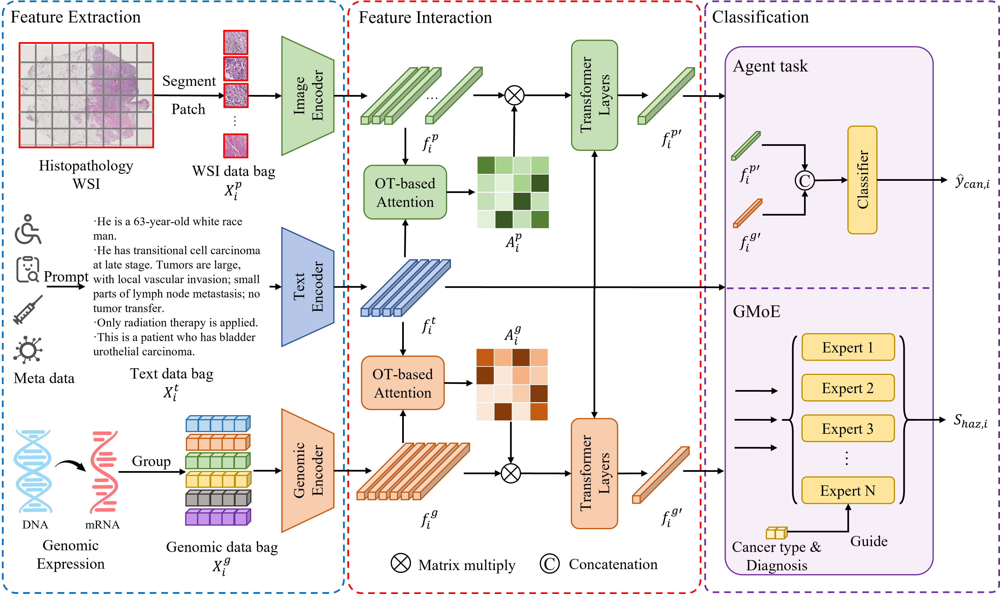

# UMPSNet

The official implement of the paper: [TBD] 

## Introduction

The contribution of the paper:

- A unified multi-modal pan-cancer prognosis model named UMPSNet, where six types of complementary patient data, including images, genes and texts, are firstly encoded by three different modal encoders, respectively. 
- To address the distributional differences among various cancer types, UMPSNet introduces the GMoE mechanism, which employs multiple experts to collaboratively accomplish the prognosis task.
- To the best of our knowledge, UMPSNet is the first model designed for pan-cancer prognosis via a joint learning paradigm. Extensive experiments on five public datasets in TCGA, namely BLCA, BRCA, GBMLGG, LUAD and UCEC, demonstrate that UMPSNet outperforms all state-of-the-art pan-cancer prognosis methods, while achieves competitive performance with those for single-cancer. 



## Instructions

### Installation

1. Download the codes.

```bash
git clone https://github.com/binging512/UMPSNet.git
cd UMPSNet
```

2. Create the environment.

```bash
conda create -n umpsnet python=3.9
conda activate umpsnet
```

3. Install the requirements.

```bash
pip install -r requirements.txt
```

### Prepare the datasets

1. Download the slide from TCGA website: https://portal.gdc.cancer.gov/
2. Use [CLAM](https://github.com/mahmoodlab/CLAM) and [CTranPath](https://github.com/Xiyue-Wang/TransPath) to patch and extract features from the WSIs.
3. (Not necessary) For genomic data, you can use the files we provided. Specifically,  ```./data/ALL/tcga_all_nan.csv``` is the genomic data, ```data/ALL/signatures.csv``` is the signature file. Or you can download and re-arrange genomic data and signature file from [cBioPortal](https://www.cbioportal.org/) and [MOTCat](https://github.com/Innse/MOTCat), respectively.
4. (Not necessary) For meta data, you can also use the files we provided. Or you can download and re-arrange them from [TCGA](https://portal.gdc.cancer.gov/) website (Clinical data).
5. Modify the config files according your own situation. Here is a detailed description of the config files.

```yaml
# Files
data_root: './data/ALL'												# Data root 
data_patch_feats: './data/ALL/patch_feat/clam_ctrans_s20/pt_files/'	# The extracted WSI feature directory
data_genomic: './data/ALL/tcga_all_nan.csv'							# The genomic data and label information file path
data_signature: './data/ALL/signatures.csv'							# The signatures file path
data_status: './data/ALL/status_all.json'							# The status file path
split_dir: './data/splits/tcga_all'									# The split files directory
split_start: 0   													# default:0 start with the first fold
split_end: 5    													# default:5 end with the end fold

# Dataset
data_name: 'Survival'												# Dataset class name
data_train_mode: 'train'											# Training mode
data_test_mode: 'val'												# Testing mode
data_collect_mode: 'transformer_embed'								# Data collection mode

# Model
model_name: 'UMPSNet'												# Model class name
model_pretrain: ''													# Pretrained or trained weights path
model_omic_sizes: [82, 328, 513, 443, 1536, 452]					# Genomic numbers of the six groups
model_fusion: 'unimodule_guided'									# Feature fusion module class name
model_num_classes: 4												# Classification number
model_loss: 'nllloss+celoss'										# Loss functions
model_loss_mode: 'multimodal+dataloss'								# Loss functions
experts_num: 10														# Experts number

epoch_num: 20														# Epoch number
grad_cum: 32														# Gradient accumulation steps
learning_rate: 0.0002												# Learning rate
weight_decay: 0.00001												# Weight decay
scheduler: ''														# Scheduler

# workspace
workspace: ./workspace/ALL_UMPSNet_ep20_b32_cls4_lr2e-4				# Result saving directory
```

### Train and test the models

1. After setup all the process, you can train the model with this command.

```bash
CUDA_VISIBLE_DEVICES=0 python run.py --train_pass --config <path_to_your_config>
```

2. After training the model, you can test the model with this command. (Remember to modify the model_pretrain path in the config)

```bash
CUDA_VISIBLE_DEVICES=0 python run.py --test_pass --config <path_to_your_config>
```

## Citation

```latex
TBD
```

